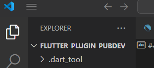
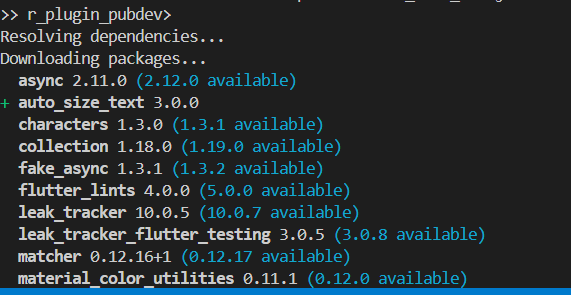
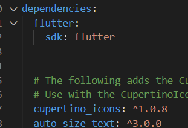
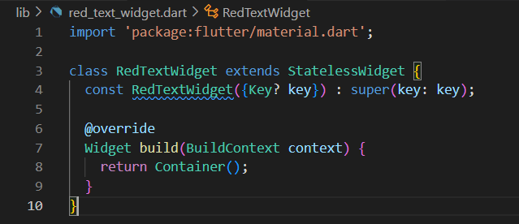
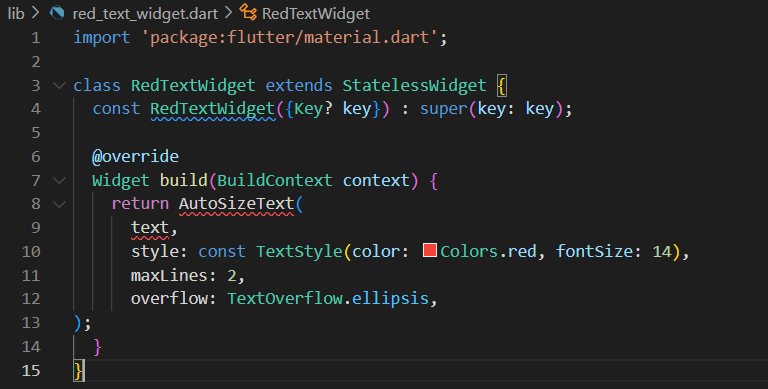
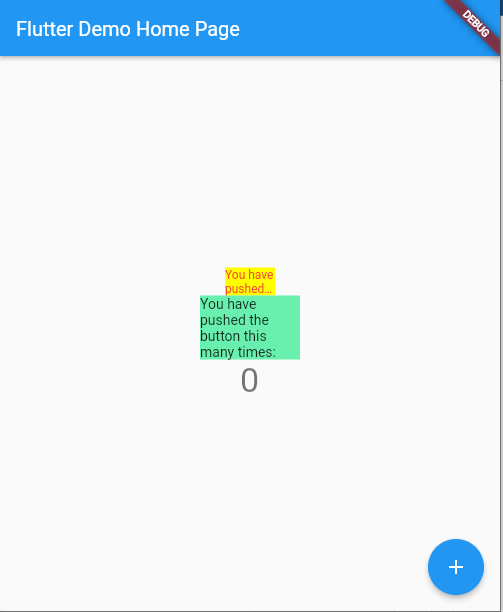
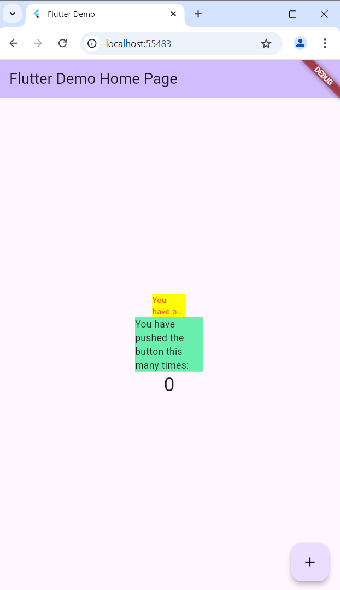

# Laporan Praktikum Pemrograman Mobile 
# Modul 7 : Manajemen Plugin

## Nama     : Zaki Lazuardi Ferysa Putra
## NIM      : 2241720101
## Kelas    : TI-3B / 27

## Praktikum Menerapkan Plugin di Project Flutter
Selesaikan langkah-langkah praktikum berikut ini menggunakan editor Visual Studio Code (VS Code) atau Android Studio atau code editor lain kesukaan Anda.

### Langkah 1 : Buat Project Baru
Buatlah sebuah project flutter baru dengan nama flutter_plugin_pubdev. Lalu jadikan repository di GitHub Anda dengan nama flutter_plugin_pubdev.

- Hasil :



### Langkah 2 : Menambahkan Plugin
Tambahkan plugin `auto_size_text` menggunakan perintah berikut di terminal.
```dart
flutter pub add auto_size_text
```

Jika berhasil, maka akan tampil nama plugin beserta versinya di file `pubspec.yaml` pada bagian dependencies.

- Hasil





### Langkah 3 : Buat file red_text_widget.dart
Buat file baru bernama `red_text_widget.dart` di dalam folder lib lalu isi kode seperti berikut.
```dart
import 'package:flutter/material.dart';

class RedTextWidget extends StatelessWidget {
  const RedTextWidget({Key? key}) : super(key: key);

  @override
  Widget build(BuildContext context) {
    return Container();
  }
}
```

- Hasil



### Langkah 4 : Tambah Widget AutoSizeText
Masih di file `red_text_widget.dart`, untuk menggunakan plugin `auto_size_text`, ubahlah kode return `Container()` menjadi seperti berikut.
```dart
return AutoSizeText(
      text,
      style: const TextStyle(color: Colors.red, fontSize: 14),
      maxLines: 2,
      overflow: TextOverflow.ellipsis,
);
```
Setelah Anda menambahkan kode di atas, Anda akan mendapatkan info error. Mengapa demikian? Jelaskan dalam laporan praktikum Anda!

- Hasil



- Jawab

Error tersebut terjadi karena plugin `AutoSizeText` belum diimpor ke dalam file `red_text_widget.dart`. 

### Langkah 5 : Buat Variabel text dan parameter di constructor
Tambahkan variabel `text` dan parameter di constructor seperti berikut.

```dart
final String text;

const RedTextWidget({Key? key, required this.text}) : super(key: key);
```

### Langkah 6 : Tambahkan widget di main.dart
Buka file `main.dart` lalu tambahkan di dalam `children:` pada class `_MyHomePageState`
```dart
Container(
   color: Colors.yellowAccent,
   width: 50,
   child: const RedTextWidget(
             text: 'You have pushed the button this many times:',
          ),
),
Container(
    color: Colors.greenAccent,
    width: 100,
    child: const Text(
           'You have pushed the button this many times:',
          ),
),
```

Run aplikasi tersebut dengan tekan F5, maka hasilnya akan seperti berikut.



- Hasil



## Tugas Praktikum
1. Selesaikan Praktikum tersebut, lalu dokumentasikan dan push ke repository Anda berupa screenshot hasil pekerjaan beserta penjelasannya di file README.md!
2. Jelaskan maksud dari langkah 2 pada praktikum tersebut!

- Jawab

  Pada langkah 2, perintah `flutter pub add auto_size_text` digunakan untuk menambahkan plugin `auto_size_text` ke dalam project Flutter. Plugin ini memungkinkan teks dalam aplikasi untuk otomatis menyesuaikan ukuran sesuai ruang yang tersedia. Ketika perintah dijalankan, Flutter akan memperbarui file `pubspec.yaml` untuk menyertakan dependensi ini beserta versinya. Dengan begitu, Flutter akan mengenali dan mengunduh plugin yang dibutuhkan.

3. Jelaskan maksud dari langkah 5 pada praktikum tersebut!

- Jawab

  Pada langkah 5, variabel `text` dan parameter di constructor ditambahkan agar widget `RedTextWidget` dapat menerima teks dari luar kelas melalui constructor-nya. Variabel `text` bertipe `String` dibuat sebagai parameter yang wajib diisi saat membuat instance `RedTextWidget`. Ini memberikan fleksibilitas pada widget untuk menampilkan teks yang berbeda setiap kali digunakan, tanpa harus mengubah kode di dalam widget itu sendiri.

4. Pada langkah 6 terdapat dua widget yang ditambahkan, jelaskan fungsi dan perbedaannya!

- Jawab

  Dua widget ditambahkan dengan fungsi dan perbedaan sebagai berikut:
  - RedTextWidget: Ini adalah widget kustom yang menggunakan plugin AutoSizeText. Teks yang ditampilkan di dalamnya otomatis menyesuaikan ukurannya agar sesuai dengan lebar wadah yang disediakan. Dalam contoh, wadah berwarna kuning dengan lebar 50. Plugin ini mencegah teks terpotong atau tampak terlalu kecil jika tidak ada cukup ruang.

  - Text: Ini adalah widget bawaan Flutter untuk menampilkan teks. Pada contoh ini, teks ditampilkan di dalam wadah berwarna hijau dengan lebar 100. Tidak ada penyesuaian otomatis pada ukuran teks; jika teks terlalu panjang untuk wadah, itu akan terpotong atau meluap.

5. Jelaskan maksud dari tiap parameter yang ada di dalam plugin `auto_size_text` berdasarkan tautan pada dokumentasi ini !

- Jawab

| Parameter | Keterangan |
|-----------|------------|
| key* | Mengontrol bagaimana satu widget menggantikan widget lain di dalam pohon widget.|
| textKey | Menetapkan kunci untuk widget Teks yang dihasilkan. |
| style* | Jika tidak null, gaya yang digunakan untuk teks ini. |
| minFontSize | Batas ukuran teks minimum yang digunakan saat menyesuaikan ukuran teks secara otomatis. Diabaikan jika presetFontSizes diatur.|
| maxFontSize | Batas ukuran teks maksimum yang digunakan saat menyesuaikan ukuran teks secara otomatis. Diabaikan jika presetFontSizes diatur. |
| stepGranularity | Ukuran langkah di mana ukuran font disesuaikan dengan batasan. |
| presetFontSizes | Menentukan semua ukuran font yang mungkin. Penting: presetFontSizes harus dalam urutan menurun. |
| group | Menyinkronkan ukuran beberapa AutoSizeText. |
| textAlign* | Bagaimana teks harus diratakan secara horizontal. |
| textDirection* | Arah teks. Ini memutuskan bagaimana nilai textAlign seperti TextAlign.start dan TextAlign.end ditafsirkan. |
| locale* | Digunakan untuk memilih font ketika karakter Unicode yang sama dapat dirender berbeda, tergantung pada lokal. |
| softWrap* | Apakah teks harus terputus pada jeda baris lunak. |
| wrapWords | Apakah kata-kata yang tidak muat dalam satu baris harus dibungkus. Default-nya true untuk berperilaku seperti Text. |
| overflow* | Bagaimana visual overflow harus ditangani. |
| overflowReplacement | Jika teks meluap dan tidak muat dalam batasnya, widget ini ditampilkan sebagai gantinya. |
| textScaleFactor* | Jumlah piksel font untuk setiap piksel logis. Juga mempengaruhi minFontSize, maxFontSize, dan presetFontSizes. |
| maxLines | Jumlah maksimum baris opsional untuk rentang teks. |
| semanticsLabel\* | Label semantik alternatif untuk teks ini. |

6. Kumpulkan laporan praktikum Anda berupa link repository GitHub kepada dosen!

## Tugas Kelompok PBL